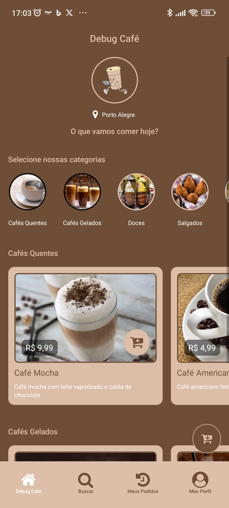

# ☕ Debug Café (Projeto feito para trabalho da faculdade)

Bem-vindo ao **Debug Café**, o aplicativo mobile de delivery de cafeteria, desenvolvido com **React Native**, **NativeWind**, **Expo Router** e **Gluestack UI**.  
Nosso objetivo é trazer praticidade e estilo para amantes de café!



## 🛠️ Tecnologias Utilizadas

- **React Native**: para desenvolvimento cross-platform.
- **Expo Router**: para roteamento eficiente.
- **NativeWind**: para estilização com classe e produtividade.
- **Gluestack UI**: para componentes UI customizáveis e modernos.

## 🎨 Paleta de Cores

As cores foram cuidadosamente escolhidas para refletir o tema aconchegante e envolvente de uma cafeteria:

- **Marrom Café**: `#6F4E37`
- **Bege Cremoso**: `#DDBEA9`
- **Branco Neve**: `#FFFFFF`

## 🚀 Funcionalidades

- 📋 Menu de Cafés e Sobremesas.
- 🛒 Carrinho de compras dinâmico.
- 📍 Localização e opções de entrega.
- 💳 Pagamento direto pelo app.

## 🚀 Como testar o aplicativo em seu celular

1. Acesse e baixe:
   [v1.0.0](https://github.com/ycarlosedu/debug-cafe-app/releases/download/1.0.0/debug-cafe-v.1.0.0.apk)

2. Abra o arquivo em seu celular e instale (pode aparecer algum aviso de perigo, mas é normal, apenas confirme)

3. Execute o app.

## 🔧 Como Executar o Projeto Localmente

1. Clone o repositório:
   ```bash
   git clone https://github.com/ycarlosedu/debug-cafe-app.git
   ```
2. Acesse o diretório do projeto:
   ```bash
   cd debug-cafe-app
   ```
3. Instale as dependências:
   ```bash
   npm install
   ```
4. Execute o projeto:
   ```bash
   npm start
   ```
5. Leia o QR Code com o Expo Go (iOS/Android) ou execute no emulador.

## 🤝 Contribuições

Contribuições são bem-vindas! Sinta-se à vontade para abrir issues ou enviar pull requests.

## 📄 Licença

Este projeto é licenciado sob a licença MIT. Consulte o arquivo [LICENSE](./LICENSE) para mais detalhes.

## 💌 Contato

Criado por [Carlos Silva](https://www.linkedin.com/in/silvacarlosoliveira/). Entre em contato para dúvidas ou sugestões!
